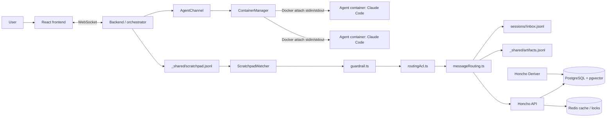

# CoAgent

[中文文档](./README.zh-CN.md)

CoAgent is a local-first multi-agent orchestration workspace for Claude Code. It provides a React terminal canvas, a TypeScript orchestrator, per-agent Docker runtime containers, file-backed agent coordination, guardrails, and Honcho semantic memory backed by PostgreSQL/pgvector and Redis.

## Highlights

- Visual multi-agent workspace with overview, focus, terminal, chat, and artifact views.
- Default sandbox mode: one Docker container per agent, managed by the orchestrator.
- Agent communication through JSONL workspace files: `scratchpad.jsonl`, `inbox.jsonl`, `artifacts.jsonl`, and memory/audit records.
- Routing layer with message guardrails, PII redaction, routing ACLs, and terminal-safe notification sanitisation.
- Honcho integration for cross-session memory, semantic recall, and derived observations.
- WebSocket observability for live terminal output, agent status, messages, artifacts, and usage/cost summaries.
- CI gates for CodeQL SAST, Gitleaks, type checking, build validation, tests, AI security tests, and dependency audit.

## Quick Start

### Prerequisites

- Node.js v20-v24
- Docker Desktop or Docker Engine with Compose
- Anthropic API key for Claude Code agents
- Gemini or OpenAI API key for Honcho embeddings
- macOS or Linux shell environment

### Option A: Interactive setup

```bash
git clone https://github.com/jinyy20021018-design/AI-CompanyOps.git
cd AI-CompanyOps
./bin/coagent-cli
```

On first run, the CLI wizard checks prerequisites, configures API keys, clones Honcho as a sibling directory if needed, installs dependencies, starts the local stack, and opens the UI.

### Option B: Environment-file setup

```bash
cp .env.example .env
# Fill ANTHROPIC_API_KEY and one embedding provider key.
make start
```

The UI is served at:

```text
http://localhost:5173
```

## Commands

| Command | Purpose |
| --- | --- |
| `./bin/coagent-cli` | Start CoAgent, running setup first if needed |
| `./bin/coagent-cli setup` | Re-run the first-time setup wizard |
| `./bin/coagent-cli status` | Show service health |
| `./bin/coagent-cli logs` | Tail local service logs |
| `./bin/coagent-cli stop` | Stop services and remove orphan agent containers |
| `./bin/coagent-cli restart` | Stop then start |
| `./bin/coagent-cli open` | Open the UI |
| `make start` | Bootstrap prerequisites, then start CoAgent |
| `make start-container` | Start default container mode explicitly |
| `make start-pty` | Start legacy host PTY mode |

Optional alias:

```bash
echo 'alias coagent="'$(pwd)'/bin/coagent-cli"' >> ~/.zshrc
source ~/.zshrc
```

## Architecture

CoAgent separates the agent runtime from the orchestration layer. Claude Code runs inside each agent container. CoAgent implements the surrounding system: container lifecycle, message routing, ACLs, guardrails, workspace files, artifact discovery, memory recording, audit files, and frontend observability.



## Configuration

Important environment variables:

| Variable | Required | Purpose |
| --- | --- | --- |
| `ANTHROPIC_API_KEY` | yes | Passed to Claude Code agents and copied into Honcho as `LLM_ANTHROPIC_API_KEY` |
| `LLM_GEMINI_API_KEY` or `LLM_OPENAI_API_KEY` | recommended | Embedding provider key for semantic recall |
| `LLM_EMBEDDING_PROVIDER` | recommended | `gemini` or `openai` |
| `COAGENT_MODE` | optional | `container` by default; set `pty` for legacy host PTY mode |
| `COAGENT_HOST_PROJECTS_ROOT` | optional | Host projects directory bind-mounted into orchestrator and agent containers |
| `COAGENT_HONCHO_DIR` | optional | Path to an existing Honcho checkout |

Optional Marketing / Finance hybrid-agent variables:

| Variable | Required | Purpose |
| --- | --- | --- |
| `COAGENT_DOMAIN_AGENTS` | optional | `legacy` by default; set `hybrid` to run concurrent external-data injection, or `native` to let the runtime also generate Marketing/Finance markdown artifacts |
| `COAGENT_TOOL_INJECTION_ENABLED` | optional | `1` by default; set `0` to disable tool injection |
| `COAGENT_TOOL_INJECTION_CONCURRENCY` | optional | `8` by default; max concurrent tool calls |
| `COAGENT_TOOL_TIMEOUT_MS` | optional | Override per-tool timeout |
| `TAVILY_API_KEY` / `BRAVE_SEARCH_API_KEY` | optional | Web search; missing keys skip the matching tool |
| `FRED_API_KEY` | optional | FRED macro data; missing key skips the tool |
| `SEC_USER_AGENT` | optional | SEC EDGAR company facts; missing config skips the tool |
| `ALPHA_VANTAGE_API_KEY` | optional | Alpha Vantage quote data; missing key skips the tool |

Default no-key tools include Frankfurter exchange rates, World Bank indicators, and Jina Reader competitor page fetch. External tools are best-effort: fulfilled results are written to `_shared/artifacts/market/` or `_shared/artifacts/finance/`, while skipped/failed/timeout results are logged to `_shared/source-ledger.jsonl` and never block the existing agent handoff flow. In `hybrid` mode, terminal agents still own the final `gtm.md` and `financial-model.md`; in `native` mode, the backend runtime also writes those markdown artifacts and sends compatible handoffs.

## Runtime Model

Container mode is the default. `coagent-cli` starts Docker Compose services, waits for PostgreSQL and Redis health checks, runs Honcho migrations, starts Honcho API and Deriver as host `uv` processes, and starts the containerized orchestrator and frontend. The orchestrator then creates one Docker container per agent on demand.

Legacy `pty` mode is still available for local debugging, but it is not the default runtime model.

| Component | Runtime | Port | Responsibility |
| --- | --- | --- | --- |
| Frontend | Docker container | `5173` | React UI and WebSocket client |
| Orchestrator/backend | Docker container in container mode | `3001` | HTTP/WebSocket API, sessions, routing, agents |
| Agent runtime | Dynamic Docker containers | none | Claude Code execution, one container per agent |
| Docker socket proxy | Docker container | internal | Restricted Docker API access for the orchestrator |
| PostgreSQL | Docker container, `pgvector/pgvector:pg17` | `5432` | Honcho relational and vector storage |
| Redis | Docker container, `redis:7-alpine` | `6379` | Honcho cache and lock support |
| Honcho API | Host `uv` process | `8000` | Memory API |
| Honcho Deriver | Host `uv` process | none | Derived semantic memory generation |

## Agent Communication

Messages flow through workspace files first, then into the live UI and memory layer:

```text
coagent send
  -> CoAgent_workspace/_shared/scratchpad.jsonl
  -> ScratchpadWatcher
  -> guardrail.ts
  -> routingAcl.ts
  -> messageRouting.ts
  -> CoAgent_workspace/sessions/<agent>/inbox.jsonl
  -> WebSocket UI update
  -> AgentChannel / ContainerManager
  -> Docker attach stream notification
  -> Honcho memory
```

This design gives the system an auditable message trail even when an agent container is offline or restarted.

## Storage

CoAgent uses three storage layers:

| Layer | Location | Purpose |
| --- | --- | --- |
| Workspace JSONL files | `CoAgent_workspace/` | Operational log, inboxes, artifacts, usage, decisions, and memory handoff files |
| PostgreSQL + pgvector | Docker volume `coagent_postgres_data` | Honcho sessions, peers, messages, embeddings, derived documents, and vector search |
| Redis | Docker volume `coagent_redis_data` | Honcho cache and lock coordination |

Workspace files are operational and audit-oriented. PostgreSQL is the semantic memory database.

## Security

Security controls are implemented across runtime, routing, and CI:

- Prompt injection patterns are blocked by `backend/src/guardrail.ts`.
- Structured PII is redacted before routing and memory recording.
- Terminal control characters are stripped before PTY/container notification writes.
- High-risk message types are restricted by `backend/src/routingAcl.ts`.
- Agent containers drop Linux capabilities, use `no-new-privileges`, and enforce CPU, memory, and PID limits.
- CI runs CodeQL, Gitleaks, AI security regression tests, and dependency audit.

These controls reduce risk; they do not remove the need for human review of agent output.

## Development

Install dependencies:

```bash
npm install
npm install -w backend
npm install -w frontend
```

Run backend and frontend locally in legacy PTY mode:

```bash
COAGENT_MODE=pty HONCHO_BASE_URL=http://localhost:8000 HONCHO_API_KEY=local npm run dev
```

Quality checks:

```bash
npm run typecheck -w backend
npm run typecheck -w frontend
npm run build -w backend
npm run build -w frontend
npm run test -w backend
npm run test -w frontend
```

Main source layout:

```text
backend/src/
  agentChannel.ts        Runtime transport abstraction
  containerManager.ts    Docker-backed per-agent runtime manager
  ptyManager.ts          Legacy host PTY runtime manager
  guardrail.ts           Prompt injection, PII, and control-character checks
  routingAcl.ts          Runtime ACL for high-risk message delivery
  messageRouting.ts      Scratchpad-to-inbox routing and Honcho recording
  scratchpadWatcher.ts   JSONL message bus watcher
  artifactWatcher.ts     Artifact discovery and UI updates
  honchoIntegration.ts   Memory recording and recall integration
  usageLogger.ts         Usage and cost summaries

frontend/src/
  App.tsx                Main React application shell
  components/            Terminal canvas, chat, artifacts, settings, views
  hooks/useSocket.ts     WebSocket client with reconnect handling
```

## CI/CD

GitHub Actions runs:

- CodeQL SAST for JavaScript/TypeScript
- Gitleaks secret scanning
- Backend and frontend type checks
- Backend and frontend builds
- Vitest unit/integration tests
- Guardrail and shell-injection regression tests
- Critical npm dependency audit

Tagged releases validate `VERSION`, run CI, extract `CHANGELOG.md`, and publish a GitHub Release.

## License

MIT
