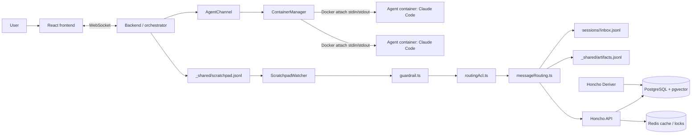

# CoAgent

[English README](./README.md)

CoAgent 是一个本地优先的 Claude Code 多智能体编排工作区。它提供 React 终端画布、TypeScript orchestrator、每个 agent 独立的 Docker 运行容器、基于文件的 agent 协作机制、消息安全控制，以及由 Honcho、PostgreSQL/pgvector 和 Redis 支撑的语义记忆。

## 产品亮点

- 可视化多智能体工作区，支持 overview、focus、terminal、chat 和 artifact 视图。
- 默认沙箱模式：每个 agent 一个 Docker container，由 orchestrator 动态创建和管理。
- 基于 JSONL 工作区文件的通信：`scratchpad.jsonl`、`inbox.jsonl`、`artifacts.jsonl`、memory/audit 记录。
- 消息路由层包含 guardrail、PII redaction、routing ACL 和终端通知 sanitisation。
- 集成 Honcho，用于跨会话记忆、语义召回和 derived observations。
- 通过 WebSocket 实时展示终端输出、agent 状态、消息、artifact、usage/cost summary。
- CI 门禁包含 CodeQL SAST、Gitleaks、类型检查、构建校验、测试、AI security tests 和 dependency audit。

## 快速开始

### 前置要求

- Node.js v20-v24
- Docker Desktop 或支持 Compose 的 Docker Engine
- Anthropic API key，用于 Claude Code agents
- Gemini 或 OpenAI API key，用于 Honcho embeddings
- macOS 或 Linux shell 环境

### 方式 A：交互式设置

```bash
git clone https://github.com/jinyy20021018-design/AI-CompanyOps.git
cd AI-CompanyOps
./bin/coagent-cli
```

首次运行时，CLI wizard 会检查依赖、配置 API keys、在需要时把 Honcho clone 到相邻目录、安装依赖、启动本地 stack，并打开 UI。

### 方式 B：使用 `.env`

```bash
cp .env.example .env
# 填入 ANTHROPIC_API_KEY 和一个 embedding provider key。
make start
```

UI 地址：

```text
http://localhost:5173
```

## 常用命令

| 命令 | 用途 |
| --- | --- |
| `./bin/coagent-cli` | 启动 CoAgent；首次运行会先执行 setup |
| `./bin/coagent-cli setup` | 重新运行首次设置向导 |
| `./bin/coagent-cli status` | 查看服务健康状态 |
| `./bin/coagent-cli logs` | 查看本地服务日志 |
| `./bin/coagent-cli stop` | 停止服务并清理 orphan agent containers |
| `./bin/coagent-cli restart` | 停止后重新启动 |
| `./bin/coagent-cli open` | 打开 UI |
| `make start` | bootstrap 依赖后启动 CoAgent |
| `make start-container` | 显式使用默认 container mode 启动 |
| `make start-pty` | 使用 legacy host PTY mode 启动 |

可选 alias：

```bash
echo 'alias coagent="'$(pwd)'/bin/coagent-cli"' >> ~/.zshrc
source ~/.zshrc
```

## 架构

CoAgent 将 agent runtime 和 orchestration layer 分离。Claude Code 只运行在每个 agent container 内；CoAgent 自身实现 container lifecycle、message routing、ACL、guardrails、workspace files、artifact discovery、memory recording、audit files 和 frontend observability。



## 配置

关键环境变量：

| 变量 | 是否需要 | 用途 |
| --- | --- | --- |
| `ANTHROPIC_API_KEY` | 必填 | 传给 Claude Code agents，并复制给 Honcho 的 `LLM_ANTHROPIC_API_KEY` |
| `LLM_GEMINI_API_KEY` 或 `LLM_OPENAI_API_KEY` | 推荐 | 语义召回使用的 embedding provider key |
| `LLM_EMBEDDING_PROVIDER` | 推荐 | `gemini` 或 `openai` |
| `COAGENT_MODE` | 可选 | 默认 `container`；设置为 `pty` 可使用 legacy host PTY mode |
| `COAGENT_HOST_PROJECTS_ROOT` | 可选 | bind mount 到 orchestrator 和 agent containers 的宿主机项目目录 |
| `COAGENT_HONCHO_DIR` | 可选 | 已存在的 Honcho checkout 路径 |

Marketing / Finance hybrid agent 增强可选环境变量：

| 变量 | 是否需要 | 用途 |
| --- | --- | --- |
| `COAGENT_DOMAIN_AGENTS` | 可选 | 默认 `legacy`；设置为 `hybrid` 后并发注入外部工具数据；设置为 `native` 后 runtime 还会生成 Marketing/Finance markdown artifacts |
| `COAGENT_TOOL_INJECTION_ENABLED` | 可选 | 默认 `1`；设置为 `0` 可关闭工具注入 |
| `COAGENT_TOOL_INJECTION_CONCURRENCY` | 可选 | 默认 `8`；控制并发工具调用上限 |
| `COAGENT_TOOL_TIMEOUT_MS` | 可选 | 覆盖单个工具调用 timeout |
| `TAVILY_API_KEY` / `BRAVE_SEARCH_API_KEY` | 可选 | Web search；缺失时对应工具自动跳过 |
| `FRED_API_KEY` | 可选 | FRED 宏观经济数据；缺失时自动跳过 |
| `SEC_USER_AGENT` | 可选 | SEC EDGAR company facts；缺失时自动跳过 |
| `ALPHA_VANTAGE_API_KEY` | 可选 | Alpha Vantage quote data；缺失时自动跳过 |

无需 API key 的默认工具包括 Frankfurter exchange rate、World Bank indicator 和 Jina Reader competitor page fetch。所有外部工具都是 best-effort：成功结果写入 `_shared/artifacts/market/` 或 `_shared/artifacts/finance/`，失败/跳过/超时写入 `_shared/source-ledger.jsonl`，不会阻塞原有 agent handoff。`hybrid` 模式下终端 agent 仍负责最终 `gtm.md` 和 `financial-model.md`；`native` 模式下 backend runtime 也会写这些 markdown artifacts 并发送兼容 handoff。

## 运行模型

默认是 container mode。`coagent-cli` 会启动 Docker Compose services，等待 PostgreSQL 和 Redis health checks，通过 `alembic upgrade head` 执行 Honcho migration，使用 host `uv` processes 启动 Honcho API 和 Deriver，并启动 containerized orchestrator 和 frontend。之后 orchestrator 会按需动态创建 agent containers。

Legacy `pty` mode 仍可用于本地调试，但它不是默认运行模型。

| 组件 | 运行位置 | 端口 | 职责 |
| --- | --- | --- | --- |
| Frontend | Docker container | `5173` | React UI 和 WebSocket client |
| Orchestrator/backend | container mode 下为 Docker container | `3001` | HTTP/WebSocket API、sessions、routing、agents |
| Agent runtime | 动态 Docker containers | 无 | Claude Code execution；每个 agent 一个 container |
| Docker socket proxy | Docker container | internal | 为 orchestrator 提供受限 Docker API |
| PostgreSQL | Docker container, `pgvector/pgvector:pg17` | `5432` | Honcho relational 和 vector storage |
| Redis | Docker container, `redis:7-alpine` | `6379` | Honcho cache 和 lock coordination |
| Honcho API | Host `uv` process | `8000` | Memory API |
| Honcho Deriver | Host `uv` process | 无 | Derived semantic memory generation |

## Agent 通信

消息先进入 workspace files，再进入实时 UI 和 memory layer：

```text
coagent send
  -> CoAgent_workspace/_shared/scratchpad.jsonl
  -> ScratchpadWatcher
  -> guardrail.ts
  -> routingAcl.ts
  -> messageRouting.ts
  -> CoAgent_workspace/sessions/<agent>/inbox.jsonl
  -> WebSocket UI update
  -> AgentChannel / ContainerManager
  -> Docker attach stream notification
  -> Honcho memory
```

这种设计使系统即使在 agent container 离线或重启时，仍然保留可审计的消息轨迹。

## 存储

CoAgent 使用三层存储：

| 层级 | 位置 | 用途 |
| --- | --- | --- |
| Workspace JSONL files | `CoAgent_workspace/` | operation log、inbox、artifact、usage、decision、memory handoff files |
| PostgreSQL + pgvector | Docker volume `coagent_postgres_data` | Honcho sessions、peers、messages、embeddings、derived documents、vector search |
| Redis | Docker volume `coagent_redis_data` | Honcho cache 和 lock coordination |

Workspace files 主要用于操作记录和审计。PostgreSQL 是语义记忆数据库。

## 安全

当前安全控制覆盖 runtime、routing 和 CI：

- `backend/src/guardrail.ts` 阻断常见 prompt injection 模式。
- 结构化 PII 在 routing 和 memory recording 前被 redacted。
- 写入 PTY/container notification 前会移除 terminal control characters。
- `backend/src/routingAcl.ts` 限制高风险 message types。
- Agent containers drop Linux capabilities，启用 `no-new-privileges`，并限制 CPU、memory 和 PID。
- CI 运行 CodeQL、Gitleaks、AI security regression tests 和 dependency audit。

这些控制用于降低风险，但不能替代人工 review。

## 开发

安装依赖：

```bash
npm install
npm install -w backend
npm install -w frontend
```

使用 legacy PTY mode 在本地运行 backend 和 frontend：

```bash
COAGENT_MODE=pty HONCHO_BASE_URL=http://localhost:8000 HONCHO_API_KEY=local npm run dev
```

质量检查：

```bash
npm run typecheck -w backend
npm run typecheck -w frontend
npm run build -w backend
npm run build -w frontend
npm run test -w backend
npm run test -w frontend
```

主要代码结构：

```text
backend/src/
  agentChannel.ts        Runtime transport abstraction
  containerManager.ts    Docker-backed per-agent runtime manager
  ptyManager.ts          Legacy host PTY runtime manager
  guardrail.ts           Prompt injection, PII, control-character checks
  routingAcl.ts          Runtime ACL for high-risk message delivery
  messageRouting.ts      Scratchpad-to-inbox routing and Honcho recording
  scratchpadWatcher.ts   JSONL message bus watcher
  artifactWatcher.ts     Artifact discovery and UI updates
  honchoIntegration.ts   Memory recording and recall integration
  usageLogger.ts         Usage and cost summaries

frontend/src/
  App.tsx                Main React application shell
  components/            Terminal canvas、chat、artifacts、settings、views
  hooks/useSocket.ts     WebSocket client with reconnect handling
```

## CI/CD

GitHub Actions 会运行：

- CodeQL SAST for JavaScript/TypeScript
- Gitleaks secret scanning
- Backend 和 frontend type checks
- Backend 和 frontend builds
- Vitest unit/integration tests
- Guardrail 和 shell-injection regression tests
- Critical npm dependency audit

Tagged release 会校验 `VERSION`，运行 CI，从 `CHANGELOG.md` 提取 release notes，并发布 GitHub Release。

## 许可证

MIT
